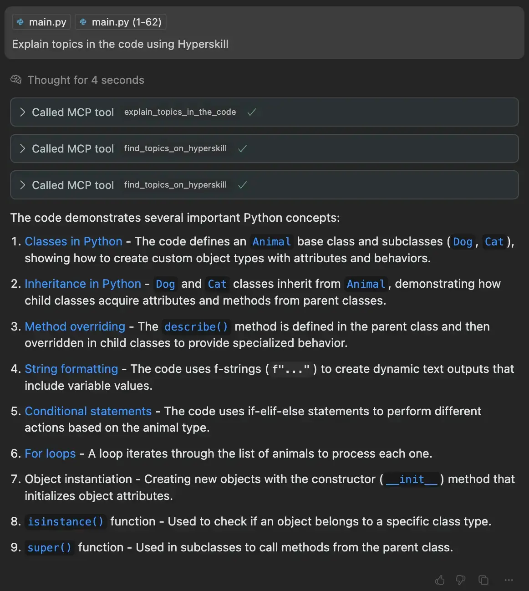

# MCP-Hyperskill

A FastMCP integration with Hyperskill that allows AI agents to explain programming topics using Hyperskill's learning resources.

## Features

- Get explanations of code concepts with links to Hyperskill topics
- Search for programming topics on Hyperskill

## Installation

```bash
# Install dependencies using UV with pyproject.toml
uv sync
```

## Usage

To run the server:

```bash
uv run main.py
```

This will start a server on `http://0.0.0.0:8080` that AI agents can connect to.

## MCP Tools

### explain_topics_in_the_code

Explains programming topics present in code by finding relevant Hyperskill resources.

Parameters:
- `topics`: List of key topics or concepts that need explanation
- `programming_language`: Programming language of the given code

### find_topics_on_hyperskill

Searches Hyperskill for specific programming topics.

Parameters:
- `topics`: List of topic keywords to search for
- `programming_language`: Programming language to filter topics by

## Example Usage

When interacting with an AI agent that has access to MCP-Hyperskill, you can ask:

```
Explain topics in the code using Hyperskill:


def fibonacci(n):
    if n <= 1:
        return n
    else:
        return fibonacci(n-1) + fibonacci(n-2)
        
result = fibonacci(10)
print(result)
```

The AI agent will identify key concepts like "recursion", "functions", and "fibonacci sequence" and provide Hyperskill links for learning more about these topics.

The response will include:
- Topic titles
- Links to Hyperskill learning resources
- Topic hierarchies showing where these concepts fit in the curriculum

<div align="center">
  
  <p><em>Example of AI explaining code topics with Hyperskill resources in Cursor</em></p>
</div>

