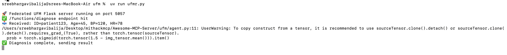

# UFM Pneumonia Diagnosis MCP Tool #MIT Hackathon

This project is a Claude-compatible **MCP (Model Context Protocol)** server for federated diagnosis using chest X-rays, patient vitals, and clinical reports.

---


## 📁 Project Structure

```
ufm_pneumonia_diagnosis_fixed/
├── ufmr.py           # MCP-compatible Flask server
├── .mcp.json         # Tool manifest for Claude Desktop
```

---

## 🚀 Getting Started

### 1. Install Requirements

You’ll need:
- Python 3.8+
- `flask`
- `uvicorn` or `uv` (used by Claude Desktop to launch the tool)

Install Flask:
```bash
pip install flask
```

---

### 2. Run Manually (Without Claude)

You can test locally like this:

```bash
PORT=5057 python ufmr.py
```

---

### 3. Test with `curl`

Simulate a diagnosis using a local X-ray:

```bash
curl -X POST http://localhost:5057/functions/diagnose \
  -F "patient_id=patient123" \
  -F "age=45" \
  -F "bp=120" \
  -F "hr=78" \
  -F "report=Patient reports fever and cough." \
  -F "xray_image=@sample_chest_xray.jpg"
```

Make sure the file `sample_chest_xray.jpg` is present in your directory.

---

## 🧪 Using with Claude Desktop

### Enable Developer Tools

1. Open **Claude Desktop**
2. Go to **Settings → General**
3. Enable: `Developer Tools` or `Advanced MCP Tooling`

### Add the Tool

1. Go to **Developer → Tools**
2. Click **Add Tool**
3. Select this folder (`ufm_pneumonia_diagnosis_fixed`)
4. Claude will:
   - Read `.mcp.json`
   - Launch `ufmr.py`
   - Register `/` as `initialize`, and `/functions/diagnose` as callable

---

## 📬 MCP Tool Metadata

From `.mcp.json`:
- Tool Name: `ufm-pneumonia-diagnosis`
- Entry File: `ufmr.py`
- Port: `5057`
- Endpoints:
  - `POST /` → MCP initialize
  - `POST /functions/diagnose` → Diagnosis handler (image + vitals)

---

Feel free to build your federated logic inside `ufmr.py` under the `/functions/diagnose` route.

Happy diagnosing! 🩺📊


---

## ✅ Example Diagnosis Output


