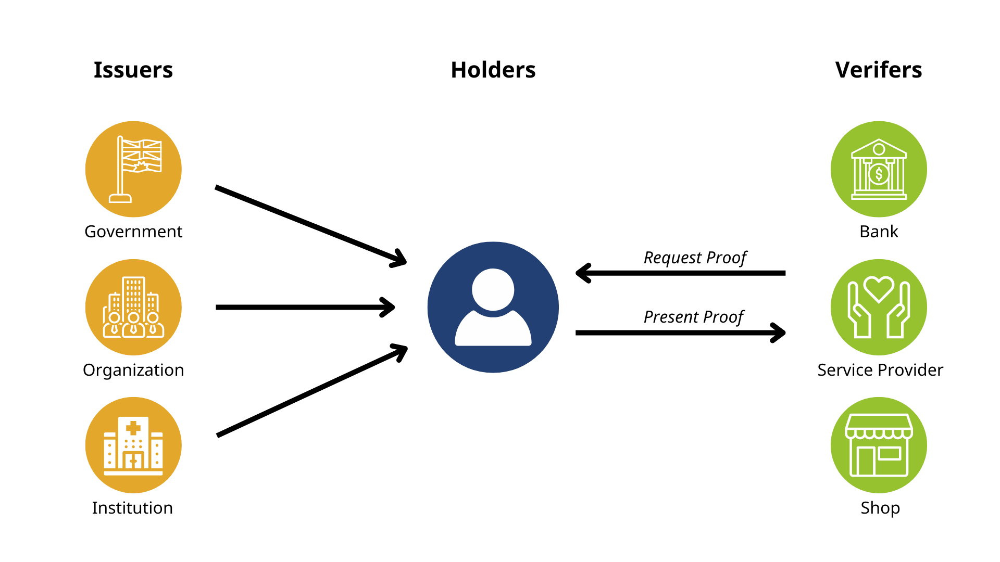
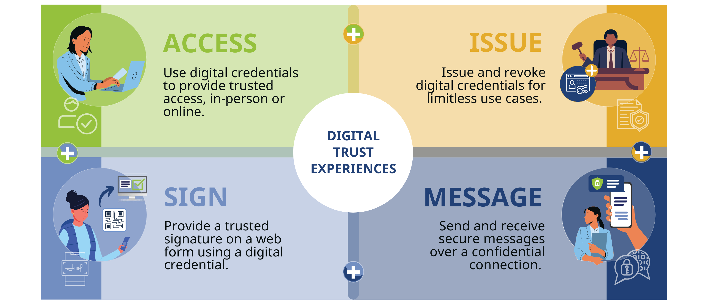

# ACA-Py Reactive MCP Server: A Decentralized Trust Layer for Agent Communications

## Overview

This project establishes a middleware communication layer between a [Traction Self-Sovereign Identity (SSI) Custodial Wallet](https://traction.xanaducyber.com) and a generative AI agent environment, using the Message-Channel-Protocol (MCP) framework. It integrates:

- A reactive client that communicates with a ChatOllama AI model  
- Multiple toolchains derived from [Traction's Swagger API](https://traction_api.xanaducyber.com)  
- Structured, multi-turn conversation flows  
- Comprehensive integration testing using a synthetic test tenant ("Alice")

The client simulates complex workflows by invoking tools in a structured fashion and summarizing outputs clearly. Tests are configured via `.example-env` and validate real-time interactions against the Traction instance.

---

## Architecture and System Design

The architecture is modular:

- **Front End:** Swagger UI, Public Portal, Business Dashboard  
- **Back End:** ACA-Py, Traction Middleware, MCP Server  
- **Reverse Proxy:** NGINX for routing and TLS termination

Agents communicate using [PeerDIDComm](https://identity.foundation/peer-did-method-spec/), supporting verifiable, encrypted messaging.

Infographics provide context on SSI components, Traction's digital infrastructure, and typical usage scenarios across justice and consumer ecosystems.

---

## Phase 1: Credential Subject-Agent Interaction with MCP

The objective is to simulate agent-driven workflows. As Alice, a test agent, the following capabilities are tested:

- ✅ Retrieve tenancy metadata  
- ✅ Register new credential schemas  
- ✅ Publish credential definitions  
- ✅ Exchange PeerDIDComm messages  
- ✅ Poll received PeerDIDComm messages  
- 🔄 Issue verifiable credentials  
- 🔄 Accept and store credentials  
- 🔄 Request proof presentations

This phase validates that independent agents can orchestrate these functions using only MCP APIs.

---

## Phase 2: Credential Holder-to-Service Provider Interactions

In this phase, we introduce **Bob**, a service agent that listens for incoming PeerDIDComm messages. Bob operates under strict trust policies, responding only to agents that present valid, verifiable credentials.

### Trust Workflow

1. **Message Reception**: Bob receives a PeerDIDComm message from Alice.
2. **Credential Verification**: Utilizing the MCP framework, Bob verifies the authenticity and validity of Alice's credentials, ensuring they meet the required trust criteria.
3. **Access Decision**: If Alice's credentials are valid and satisfy the trust policies, Bob proceeds to respond appropriately, which may include granting access to protected resources or services.

This workflow ensures that only agents with verified credentials can interact with service agents like Bob, maintaining a secure and trustworthy communication environment.

---

## Core Benefits

### 1. Agent-Native, Credential-Gated Access Control  
This system enables autonomous peer-to-peer trust evaluation: agents do not rely on centralized authorization services but instead authenticate interactions using verifiable credentials. Authorization becomes portable, auditable, and cryptographically secure.

### 2. Seamless Interoperability via Open Protocols  
Built on W3C-standard Verifiable Credentials and [DIDComm](https://identity.foundation/didcomm-messaging/spec/), agents across diverse platforms and programming stacks can interoperate without custom APIs or pre-shared secrets. This architecture fosters a plug-and-play ecosystem of composable agent services.

### 3. Real-Time, Lifecycle-Aware Credential Management  
Agents can issue, revoke, suspend, or update credentials dynamically, allowing trust relationships to evolve in step with business logic. Trust becomes an operational primitive, not a static assumption.

### 4. Credential-Driven Invocation of AI Agents  
MCP enables the deployment and invocation of AI services entirely via text-based DIDComm messages. A credentialed agent can *request*, *parameterize*, and *control* an AI function (e.g., ChatOllama) over secure, private channels—without exposing raw endpoints or keys. This pattern allows AI workflows to be orchestrated through declarative messages, governed by trust policies.

### 5. Encrypted, Authenticated Channels for Agent Dialogue  
Each PeerDIDComm tunnel is a mutually authenticated, end-to-end encrypted communication stream between two agents. Attribute disclosures and service requests are scoped to the trust context of the connection, enabling rich, private conversations and auditable message flows between agents, AI functions, and users.

---

## Role Definitions

### Agent A (Credential Holder / Consumer)
- Represents a party (e.g., Alice) wishing to prove trustworthiness  
- Holds signed credentials issued by authoritative parties

### Agent B (Service Provider)
- Receives trust claims  
- Validates credentials before allowing access to sensitive APIs or services

---

## Conclusion

This system enables scalable, credential-driven trust frameworks between autonomous agents. Using ACA-Py, Traction, and MCP, it delivers a composable, privacy-respecting infrastructure ideal for regulated environments and AI-integrated applications.

---

## Resources

- [Traction Custodial Wallet](https://traction.xanaducyber.com)  
- [Traction API Swagger Docs](https://traction_api.xanaducyber.com)  
- [PeerDIDComm Spec](https://identity.foundation/peer-did-method-spec/)

Integration test outcomes are available under `tests/test_results`.  
To simulate Alice's perspective, refer to the `.example-env` configuration file.